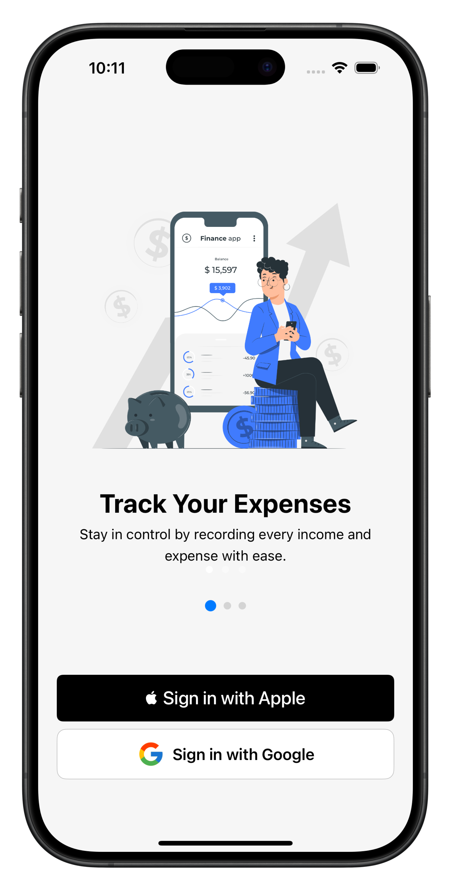
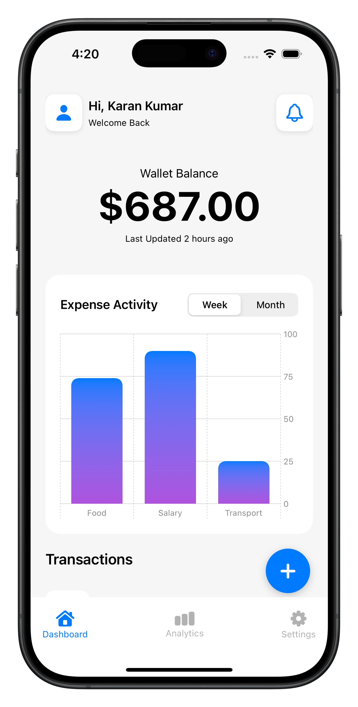

# 💰 MoneyMate - Personal Finance iOS App

MoneyMate is a modern **personal finance tracker** built with SwiftUI and SwiftData.  
It helps users manage income, expenses, categories, and financial goals in a simple and intuitive way.

---

## 🚀 Features

- 📊 **Dashboard Overview** – Track income, expenses, and balance at a glance  
- 🧾 **Smart Transactions** – Add, edit, and view detailed transactions  
- 🗂 **Category Management** – Default + custom categories with icons and colors  
- 📈 **Analytics & Insights** – Visual charts for spending patterns  
- 🎯 **Financial Goals** – Set and monitor savings targets  
- ☁️ **Cloud Ready** – Designed with offline-first support and future sync in mind  
- 🔐 **Secure Sign-In** – Google and Apple authentication (no username/password needed)  

---

## 🛠️ Tech Stack

- **Language**: Swift  
- **Frameworks**: SwiftUI, SwiftData  
- **Architecture**: MVVM  
- **Storage**: Core Data (SwiftData)  
- **UI**: Custom components with reusable views  
- **Other**: Charts, PDF/Share integration, iOS 17+ compatible  

---

## 📸 Screenshots (App Store Preview)
| Onboard | Dashboard | Analytics |
|---------|-----------|-----------|
|  |  |  |

## 🔮 Future Enhancements

- iCloud/Firestore sync for cross-device access  
- Budget alerts & reminders  
- Export reports as PDF/CSV  
- Multi-currency support  

---

## 📦 Installation

1. Clone the repository  
   ```bash
   git clone https://github.com/yourusername/moneymate.git
